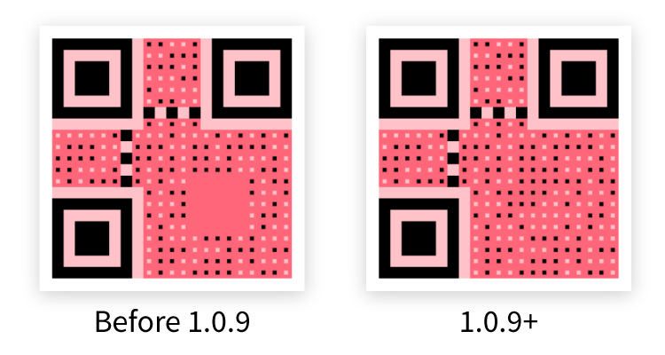
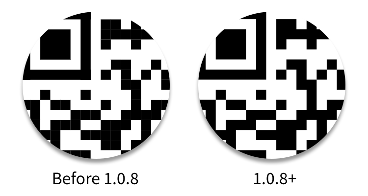

# Changelog

## Ver. 2.1.4

- Updated Webpack to v5.

## Ver. 2.1.3

- Fixed vulnerabilities in dependencies.
- Updated node-canvas.

## Ver. 2.1.2

- Fixed an issue where the QR codes were not drawing correctly if a logo image was set.
- Fixed the incorrectly typed option `logoImage` in _Options_.
- Optimized the style of logo in the QR code.

## Ver. 2.1.1

- Fixed an issue on protectors drawing for alignment patterns.

## Ver. 2.1.0

- Separate controls for scaling components in the QR code.

## Ver. 2.0.1

- Option now supports specifying QR mask pattern and QR version.

## Ver. 2.0.0

- Use Webpack as module bundler.
- Compatibility fixes for web browsers and Node.js

## Ver. 1.2.0

- Added the support for Node.js.

## Ver. 1.1.0

- Added the support for GIF backgrounds.

## Ver. 1.0.10

- Fixed a bug in the core library which would cause the too-early overflow.

## Ver. 1.0.9

- Fixed a bug which would leave an empty space on the simple QRCode image which has no alignment patterns.

## Ver. 1.0.8

- Fixed a bug which would leave white stripes between neighboring blocks while drawing QRCode at scale `1.0`.

## Ver. 1.0.7

- Minor fixes.

## Ver. 1.0.6

- Fixed an issue related to the coordinate system.

## Ver. 1.0.5

- Now you may use Awesome-qr.js with [require.js](http://requirejs.org/).
- New feature: Embedding a logo image in the QR code.
- Added some features which previously only available on Android platform.

## Ver. 1.0.4

- Compatibility improved.

## Ver. 1.0.3

- Now generated QR codes can be automatically filled into specified elements.

## Ver. 1.0.2, 1.0.1

- Published to npmjs.
- Now background images can be binarized.

## Ver 1.0.0

- Initial release.
