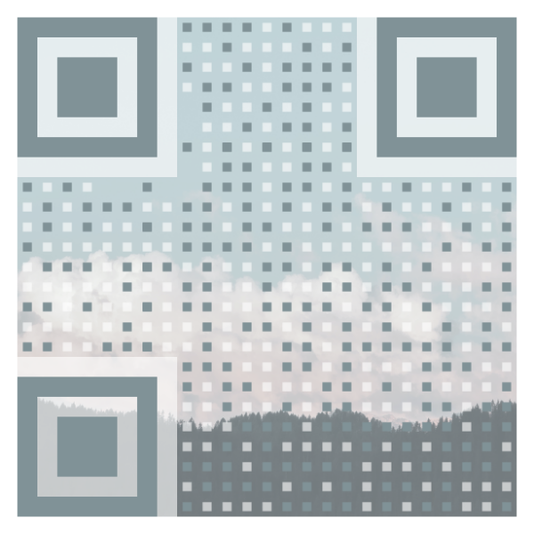

# Awesome-qr.js <!-- omit in toc -->

   [](https://www.apache.org/licenses/LICENSE-2.0)

An awesome but simple QR code generator written in JavaScript.

## Gallery <!-- omit in toc -->

> These QR codes were made with Awesome-qr.js 🤗

<table>
	<tr>
		<td valign="top"></td>
    	<td valign="top"></td>
    	<td valign="top"></td>
  	</tr>
</table>

## Contents <!-- omit in toc -->

- [Getting Started](#getting-started)
  - [Node.js](#nodejs)
  - [Browsers](#browsers)
- [Options](#options)
  - [text](#text)
  - [size](#size)
  - [margin](#margin)
  - [correctLevel](#correctlevel)
  - [maskPattern](#maskpattern)
  - [version](#version)
  - [<del>dotScale</del> (DEPRECATED)](#deldotscaledel-deprecated)
  - [components](#components)
  - [colorDark](#colordark)
  - [colorLight](#colorlight)
  - [autoColor](#autocolor)
  - [backgroundImage](#backgroundimage)
  - [backgroundDimming](#backgrounddimming)
  - [gifBackground](#gifbackground)
  - [whiteMargin](#whitemargin)
  - [logoImage](#logoimage)
  - [logoScale](#logoscale)
  - [logoMargin](#logomargin)
  - [logoCornerRadius](#logocornerradius)
- [ComponentOptions](#componentoptions)
  - [scale](#scale)
  - [protectors](#protectors)
- [Sponsors](#sponsors)
- [Changelog](#changelog)
- [Special thanks](#special-thanks)
- [AwesomeQRCode: Designed for Android](#awesomeqrcode-designed-for-android)
- [Other versions](#other-versions)
- [Copyright &amp; License](#copyright--license)

## Getting Started

### Node.js

_Type definitions are included in the npm package._

> **Please read ⚠️**
>
> Awesome-qr.js uses node-canvas as its drawing backend. You might need to take a look at [its documentation](https://github.com/Automattic/node-canvas#installation) to ensure that node-canvas works on your environment.

```shell
yarn add awesome-qr // using Yarn
npm install --save awesome-qr // using NPM
```

> Awesome-qr.js prior to v2.0.0 **does not work well** in Node.js environment and Awesome-qr.js prior to v1.2.0 **does not work** in Node.js environment.

```js
const { AwesomeQR } = require("awesome-qr");
const fs = require("fs");

// ...

const background = fs.readFileSync("background.png");

const buffer = await new AwesomeQR({
  text: "AwesomeQR by Makito - Awesome, right now.",
  size: 500,
  backgroundImage: background,
}).draw();

fs.writeFileSync("qrcode.png", buffer);
```

### Browsers

> ⚛️ &nbsp; If you're using React, please use [react-awesome-qr](https://github.com/AwesomeQR/react-awesome-qr).

```html
<!-- import to the global scope -->
<script src="dist/awesome-qr.js"></script>

<!-- or use require.js -->
<script>
  require(["dist/awesome-qr.js"], (AwesomeQR) => ...);
</script>
```

```js
var background;
var reader = new FileReader();
reader.onload = function () {
  background = this.result;
  new AwesomeQR({
    text: "AwesomeQR by Makito - Awesome, right now.",
    size: 500,
    backgroundImage: background,
  }).draw().then((dataURL) => );
};
reader.readAsDataURL(file);
```

## Options

> _Options_ is an object that you can pass to the generator to customize your QR code.

```ts
type Options = {
  text: string;
  size?: number;
  margin?: number;
  correctLevel?: number;
  maskPattern?: number;
  version?: number;
  dotScale?: number;
  components?: ComponentOptions;
  colorDark?: string;
  colorLight?: string;
  autoColor?: boolean;
  backgroundImage?: string | Buffer;
  backgroundDimming?: string;
  gifBackground?: ArrayBuffer;
  whiteMargin?: boolean;
  logoImage?: string | Buffer;
  logoScale?: number;
  logoMargin?: number;
  logoCornerRadius?: number;
};
```

### text

**Type** `string`

Text to be encoded in the QR code.

<hr/>

### size

**Type** `number?`

**Default** `400`

Size of the QR code in pixel.

<hr/>

### margin

**Type** `number?`

**Default** `20`

Size of margins around the QR code body in pixel.

<hr/>

### correctLevel

**Type** `number?`

**Default** `QRErrorCorrectLevel.M` ~> `0`

> For more information, please refer to [Error correction feature | QRcode.com | DENSO WAVE](https://www.qrcode.com/en/about/error_correction.html).

Error correction level of the QR code.

<hr/>

### maskPattern

**Type** `number?`

**This is an advanced option.**

Leave untouched to let the code decide which mask pattern to use.

Specify the mask pattern to be used in QR code encoding.

Accepts a value provided by _QRMaskPattern_.

> To find out all eight mask patterns, please refer to [Wikipedia File:QR_Code_Mask_Patterns.svg](https://en.wikipedia.org/wiki/File:QR_Code_Mask_Patterns.svg)

> For more information, please refer to [Reed–Solomon codes for coders: Masking](https://en.wikiversity.org/wiki/Reed%E2%80%93Solomon_codes_for_coders#Masking).

<hr/>

### version

**Type** `number?`

**This is an advanced option.**

Leave untouched to let the code decide which version to use.

Specify the version to be used in QR code encoding.

Accepts an integer in range [1, 40].

**⚠️ &nbsp; An error might occurs if the specified version does not have enough space for the input data.**

> For more information, please refer to [Information capacity and versions of QR Code | QRcode.com | DENSO WAVE](https://www.qrcode.com/en/about/version.html).

<hr/>

### <del>dotScale</del> (DEPRECATED)

**Type** `number?`

**Default** `0.4`

Use [components](#components) to control the scaling in a more advanced way.

> This option is yet to be removed. You can still use this option to control the scaling of the QR code parts in the lagacy way.

Ratio of the real size to the full size of the blocks.

This can be helpful when you want to make more parts of the background visible.

<hr/>

### components

**Type** [ComponentOptions](#componentoptions)

Controls the appearances of parts in the QR code.

Read section [ComponentOptions](#componentoptions) to learn more.

<hr/>

### colorDark

**Type** `string?, CSS <color>`

**Default** `"#000000"`

> For more information about CSS &lt;color&gt;, please refer to [&lt;color&gt; - CSS: Cascading Style Sheets | MDN](https://developer.mozilla.org/en-US/docs/Web/CSS/color_value)

Color of the blocks on the QR code.

<hr/>

### colorLight

**Type** `string?, CSS <color>`

**Default** `"#ffffff"`

Color of the empty areas on the QR code.

<hr/>

### autoColor

**Type** `boolean?`

**Default** `true`

Automatically calculate the _colorDark_ value from the QR code's background.

<hr/>

### backgroundImage

**Type** `(string|Buffer)?`

**Default** `undefined`

Background image to be used in the QR code.

Accepts a `data:` string in web browsers or a Buffer in Node.js.

<hr/>

### backgroundDimming

**Type** `string?, CSS <color>`

**Default** `"rgba(0, 0, 0, 0)"`

Color of the dimming mask above the background image.

<hr/>

### gifBackground

**Type** `ArrayBuffer?`

**Default** `undefined`

GIF background image to be used in the QR code.

<hr/>

### whiteMargin

**Type** `boolean?`

**Default** `true`

Use a white margin instead of a transparent one which reveals the background of the QR code on margins.

<hr/>

### logoImage

**Type** `(string|Buffer)?`

**Default** `undefined`

Logo image to be displayed at the center of the QR code.

Accepts a `data:` string in web browsers or a Buffer in Node.js.

When set to `undefined` or `null`, the logo is disabled.

<hr/>

### logoScale

**Type** `number?`

**Default** `0.2`

Ratio of the logo size to the QR code size.

<hr/>

### logoMargin

**Type** `number?`

**Default** `6`

Size of margins around the logo image in pixels.

<hr/>

### logoCornerRadius

**Type** `number?`

**Default** `8`

Corner radius of the logo image in pixels.

## ComponentOptions

> _ComponentOptions_ controls the appearances of parts in the QR code.

```ts
type ComponentOptions = {
  data?: {
    scale?: number;
  };
  timing?: {
    scale?: number;
    protectors?: boolean;
  };
  alignment?: {
    scale?: number;
    protectors?: boolean;
  };
  cornerAlignment?: {
    scale?: number;
    protectors?: boolean;
  };
};
```

```ts
// default ComponentOptions

{
  data: {
    scale: 0.4,
  },
  timing: {
    scale: 0.5,
    protectors: false,
  },
  alignment: {
    scale: 0.5,
    protectors: false,
  },
  cornerAlignment: {
    scale: 0.5,
    protectors: true,
  },
}
```

### scale

**Type** `number?`

Scale factor for blocks in the specified area of the QR code.

<hr/>

### protectors

**Type** `boolean?`

Controls whether or not to draw the translucent protectors under the specified area in the QR code.

## Sponsors

It is those generous sponsors who supports this project makes the Awesome-qr.js more awesome!

I'd like to express my sincere appreciation to all the generous sponsors.

- [Coxxs](https://coxxs.me/)

Since sponsors' names will not show up here without their permissions, the list above only shows a part of all the sponsors. If you wish to have your name shown up here, please feel free to contact me.

## Changelog

[Check the full changelog](CHANGELOG.md)

## Special thanks

Awesome-qr.js is inspired by [EFQRCode by EyreFree](https://github.com/EyreFree/EFQRCode).

EFQRCode is a tool to generate QRCode image or recognize QRCode from image, in Swift.

If your application is in need of generating pretty QR codes in Swift, take a look at EFQRCode. It should help.

## AwesomeQRCode: Designed for Android

Also, if you are developing Android apps, you can take a look at [AwesomeQRCode](https://github.com/SumiMakito/AwesomeQRCode), which is designed for Android projects.

## Other versions

- React component: [react-awesome-qr](https://github.com/AwesomeQR/react-awesome-qr)
- Vue 2.x component: [Vue-qr](https://github.com/Binaryify/vue-qr)

## Copyright &amp; License

Awesome-qr.js is licensed under Apache License 2.0 License.

```
Copyright (c) 2017-2020 Makito

Licensed under the Apache License, Version 2.0 (the "License");
you may not use this file except in compliance with the License.
You may obtain a copy of the License at

    http://www.apache.org/licenses/LICENSE-2.0

Unless required by applicable law or agreed to in writing, software
distributed under the License is distributed on an "AS IS" BASIS,
WITHOUT WARRANTIES OR CONDITIONS OF ANY KIND, either express or implied.
See the License for the specific language governing permissions and
limitations under the License.
```

```
jquery-qrcode
Copyright (c) 2011 Jerome Etienne, http://jetienne.com

Permission is hereby granted, free of charge, to any person obtaining
a copy of this software and associated documentation files (the
"Software"), to deal in the Software without restriction, including
without limitation the rights to use, copy, modify, merge, publish,
distribute, sublicense, and/or sell copies of the Software, and to
permit persons to whom the Software is furnished to do so, subject to
the following conditions:

The above copyright notice and this permission notice shall be
included in all copies or substantial portions of the Software.

THE SOFTWARE IS PROVIDED "AS IS", WITHOUT WARRANTY OF ANY KIND,
EXPRESS OR IMPLIED, INCLUDING BUT NOT LIMITED TO THE WARRANTIES OF
MERCHANTABILITY, FITNESS FOR A PARTICULAR PURPOSE AND
NONINFRINGEMENT. IN NO EVENT SHALL THE AUTHORS OR COPYRIGHT HOLDERS BE
LIABLE FOR ANY CLAIM, DAMAGES OR OTHER LIABILITY, WHETHER IN AN ACTION
OF CONTRACT, TORT OR OTHERWISE, ARISING FROM, OUT OF OR IN CONNECTION
WITH THE SOFTWARE OR THE USE OR OTHER DEALINGS IN THE SOFTWARE.
```

```
QRCode for JavaScript
Copyright (c) 2009 Kazuhiko Arase
URL: http://www.d-project.com/
Licensed under the MIT license:
    http://www.opensource.org/licenses/mit-license.php
The word "QR Code" is registered trademark of
DENSO WAVE INCORPORATED
    http://www.denso-wave.com/qrcode/faqpatent-e.html
```
